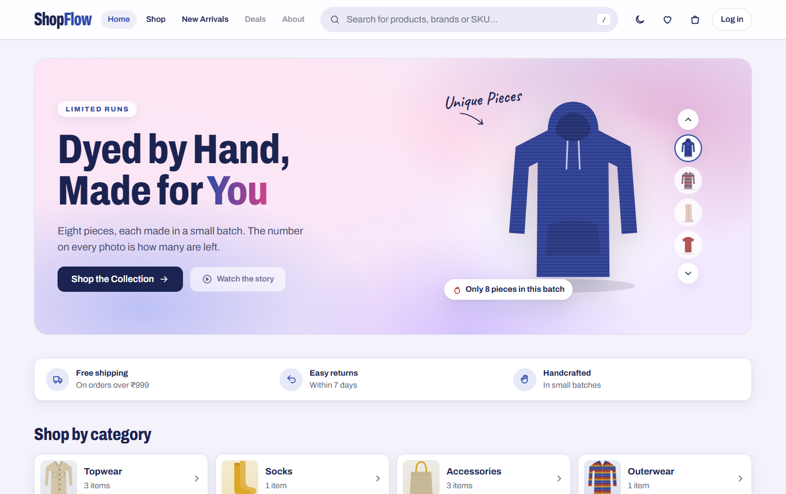
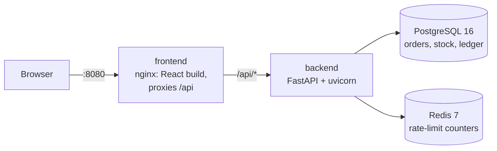
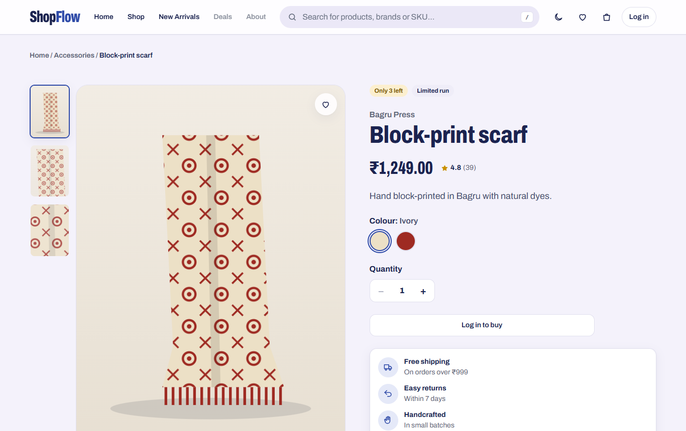
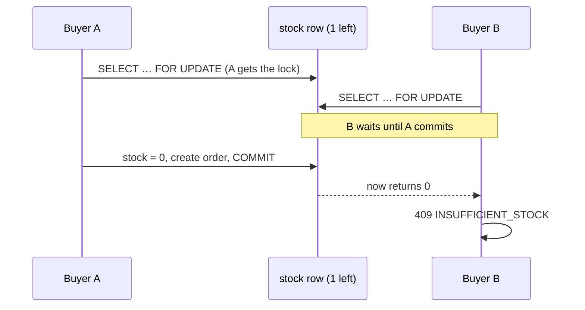
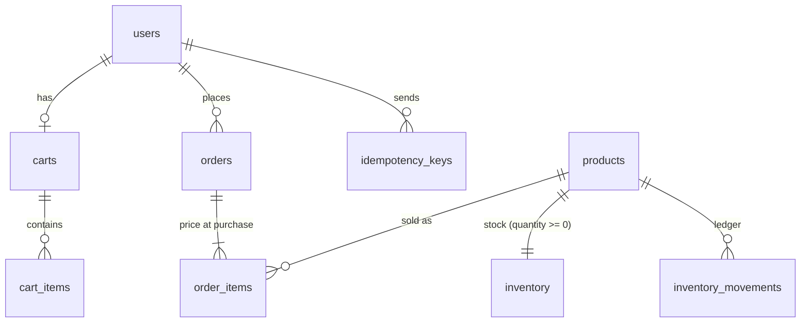

# ShopFlow

An e-commerce order and inventory backend built to survive a flash sale: many buyers, few units, all clicking at
once. FastAPI, PostgreSQL and Redis, with a React storefront for a small-batch clothing label. In a local load test, 500 simultaneous buyers
competed for 100 units: exactly 100 orders, 400 clean "sold out" responses, **0 units oversold**.



## The problem

A shop with limited stock gets hit by a burst of simultaneous checkouts. Three things go wrong in naive code:

1. **Overselling.** Two buyers both read "1 left", both buy it. No single write is negative, so a `quantity >= 0`
   constraint alone doesn't catch it.
2. **Duplicate orders.** A checkout times out on a flaky network, the client retries, and the buyer is charged twice.
3. **Collapse under load.** A burst of requests exhausts threads and database connections and the whole server stalls.

ShopFlow's answers: row locks taken in a fixed order inside one transaction (no overselling, no deadlocks),
idempotency keys backed by a unique constraint (retries return the first result), a per-user rate limit in Redis, and
admission control that queues or sheds excess requests instead of stalling.

## Architecture



- **Backend:** routers (HTTP only) → services (business rules, transactions, locking) → SQLAlchemy models. One error
  shape everywhere: `{"error": {"code", "message", "details"}}`. JSON logs with a request id that nginx passes through.
- **Frontend:** React + TypeScript (Vite), served by nginx on the same origin as the API, so no CORS. Brand, category,
  colours, sizes and imagery come from a presentation layer (`frontend/src/lib/catalog.ts`) keyed by SKU; the API
  only knows real product fields, and none of the presentation data is ever sent to it.
- **Docker Compose:** health-checked start order: postgres and redis → backend (runs migrations, seeds demo data,
  then serves) → frontend.

## Stack

| | |
|---|---|
| Backend | Python 3.12, FastAPI, Pydantic v2, SQLAlchemy 2, Alembic, psycopg 3 |
| Data | PostgreSQL 16 (row locks, constraints, advisory locks), Redis 7 (rate limiting) |
| Auth | JWT access tokens (PyJWT, HS256), argon2id password hashing |
| Frontend | React 19, TypeScript, Vite, Tailwind CSS v4, React Router |
| Tests | pytest against real PostgreSQL + Redis, vitest, Playwright (browser check), k6 (load) |
| Ops | Docker, Docker Compose, nginx |

## Features

- **Accounts:** register, login, JWT, `customer` / `admin` roles. Admins are only created by the seed script.
- **Catalogue:** admin create / update / soft-delete; public list with search (name or SKU) and pagination.
- **Inventory:** stock can't go negative (checked in code and by a DB `CHECK`); every change is written to an
  `inventory_movements` ledger (restock, order, cancel, adjustment).
- **Cart:** one per user, totals always computed on the server.
- **Orders:** checkout reserves stock in one transaction; prices are frozen at purchase; cancelling returns the stock;
  statuses `pending → confirmed → shipped` or `cancelled`, with invalid changes rejected (409).
- **Idempotent checkout:** `Idempotency-Key` header required; a retry replays the original response.
- **Rate limiting:** per-user checkout limit in Redis; if Redis is down it fails open (and logs a warning).
- **Admission control:** at most as many requests in flight as there are DB connections; the rest queue, then get
  503 + `Retry-After`.
- **Observability:** JSON logs, request ids, `GET /api/health` checking PostgreSQL and Redis.
- **Storefront:** home page with hero and category cards; listing with filters (category, brand, material, colour,
  price range, in stock only) that show live counts, sorting and grid/list views; product page with gallery, colour
  and size selection; cart drawer and bag page; wishlist; light and dark mode; mobile layout with a filter drawer.
  The stock badge on every photo uses one colour code: indigo in stock, turmeric low (5 or fewer), madder sold out.



## How the core works

### Checkout: one transaction, locks in a fixed order

1. Claim the idempotency key: `INSERT … ON CONFLICT (user_id, key) DO NOTHING`.
2. Lock the user's cart row (`SELECT … FOR UPDATE`), so one cart can't become two orders.
3. Sold-out fast path: read stock without a lock and reject straight away if it's already too low.
4. Lock the inventory rows `FOR UPDATE`, **sorted by product id** (so two carts can't deadlock), and check again: this
   check decides.
5. Create the order and items (prices copied), decrement stock, write ledger rows, empty the cart.
6. Save the response in the idempotency row, then `COMMIT`. Any failure rolls back all of it.

Why the lock matters (two buyers, one unit left):



Without `FOR UPDATE`, both read 1 and both buy. The tests prove it: with the lock removed on purpose, the 50-buyer /
10-unit test sold to all 50.

### Idempotency

The key row is inserted *first*, inside the checkout transaction, and the response is saved into it before commit. A
duplicate request arriving while the first is still running blocks on the unique index until the first commits, then
replays the stored response (header `Idempotent-Replayed: true`). Same key with a different body → 409. A failed checkout
rolls back its key, so the client can retry. Keys are unique per user.

### Admission control (found by the load test)

The first load test stalled the server: with sync endpoints, FastAPI moves each request through several hops on a
40-thread pool, and a request keeps its DB connection until its response is sent. Under a burst, every thread ended up
waiting for a connection that belonged to a request waiting for a thread. Fix: a small ASGI middleware admits at most
`DB_POOL_SIZE + DB_MAX_OVERFLOW` requests at once, so an admitted request always gets a connection. The rest wait on the
event loop, holding nothing, and are shed with 503 after `REQUEST_QUEUE_TIMEOUT_SECONDS`.

### Data model



Money is stored as integer paise (₹1 = 100 paise), never floats. Constraints have fixed names, and the tests assert
PostgreSQL rejects bad data by constraint name.

## Run it

### With Docker (everything)

```bash
cp .env.example .env
# Set JWT_SECRET and SEED_ADMIN_PASSWORD in .env. Generate values with:
python -c "import secrets; print(secrets.token_urlsafe(48))"
docker compose up --build
```

- Shop: http://localhost:8080
- API docs (OpenAPI): http://localhost:8000/docs
- Admin: `admin@example.com` with your `SEED_ADMIN_PASSWORD` (demo catalogue of 8 products is seeded on start)

### Local development

```bash
docker compose up -d postgres redis          # just the databases

cd backend
python -m venv .venv && .venv/Scripts/activate    # Windows; use .venv/bin/activate on macOS/Linux
pip install -r requirements-dev.txt
alembic upgrade head
uvicorn app.main:app --reload                 # http://127.0.0.1:8000/docs

cd ../frontend
npm install
npm run dev                                   # http://127.0.0.1:5173 (proxies /api to :8000)
```

## Configuration

All variables are listed with comments in [`.env.example`](.env.example); a test fails if a setting is missing there.
The important ones:

| Variable | Default | Purpose |
|---|---|---|
| `JWT_SECRET` | none (required) | Signs tokens. At least 32 characters; the example placeholder is rejected at startup. |
| `SEED_ADMIN_PASSWORD` | none | Demo admin password (12+ characters). Without it, no admin is created. |
| `SEED_DEMO_DATA` | `true` in `.env.example` | Seed the admin and demo products when the backend container starts. |
| `CHECKOUT_RATE_LIMIT` / `…_WINDOW_SECONDS` | 10 / 60 | Checkout attempts per user per window. |
| `DB_POOL_SIZE` / `DB_MAX_OVERFLOW` | 10 / 10 | DB connections per process; also the admission-control limit. |
| `REQUEST_QUEUE_TIMEOUT_SECONDS` | 10 | Queue wait before a request is shed with 503. |
| `WEB_CONCURRENCY` | 1 | uvicorn worker processes in the container. |
| `ACCESS_TOKEN_EXPIRE_MINUTES` | 30 | Token lifetime. |

## API

| Method | Path | Who |
|---|---|---|
| POST | `/api/auth/register`, `/api/auth/login` | anyone |
| GET | `/api/auth/me` | logged in |
| GET | `/api/products`, `/api/products/{id}` | anyone (admins also see inactive) |
| POST / PATCH / DELETE | `/api/products`, `/api/products/{id}` | admin (DELETE = soft delete) |
| GET / PATCH | `/api/inventory`, `/api/inventory/{product_id}` | admin |
| GET | `/api/inventory/{product_id}/movements` | admin |
| GET / POST / PATCH / DELETE | `/api/cart`, `/api/cart/items`, `/api/cart/items/{product_id}` | logged in |
| POST | `/api/orders` (needs `Idempotency-Key`) | logged in |
| GET | `/api/orders`, `/api/orders/{id}` | owner (admins: everyone) |
| POST | `/api/orders/{id}/cancel` | owner or admin |
| PATCH | `/api/orders/{id}/status` | admin |
| GET | `/api/health` | anyone |

### Example: register, buy, retry safely

```bash
API=http://localhost:8080/api

curl -s -X POST $API/auth/register -H 'Content-Type: application/json' \
  -d '{"email":"asha@example.com","password":"a-long-password"}'

TOKEN=$(curl -s -X POST $API/auth/login -H 'Content-Type: application/json' \
  -d '{"email":"asha@example.com","password":"a-long-password"}' | python -c "import sys,json; print(json.load(sys.stdin)['access_token'])")

PRODUCT=$(curl -s "$API/products?q=scarf" | python -c "import sys,json; print(json.load(sys.stdin)['items'][0]['id'])")

curl -s -X POST $API/cart/items -H "Authorization: Bearer $TOKEN" -H 'Content-Type: application/json' \
  -d "{\"product_id\": $PRODUCT, \"quantity\": 1}"

KEY=$(python -c "import uuid; print(uuid.uuid4())")
curl -s -X POST $API/orders -H "Authorization: Bearer $TOKEN" -H "Idempotency-Key: $KEY" \
  -H 'Content-Type: application/json' -d '{"shipping_address":"14 Residency Road, Bengaluru"}'

# Same key again (a retry): same order back, header Idempotent-Replayed: true, no second order
curl -s -i -X POST $API/orders -H "Authorization: Bearer $TOKEN" -H "Idempotency-Key: $KEY" \
  -H 'Content-Type: application/json' -d '{"shipping_address":"14 Residency Road, Bengaluru"}'
```

Errors always look like this:

```json
{"error": {"code": "INSUFFICIENT_STOCK", "message": "Some items in your cart can't be ordered",
           "details": [{"product_id": 32, "requested": 1, "available": 0, "reason": "insufficient_stock"}]}}
```

## Tests

```bash
docker compose up -d postgres redis
cd backend && pytest                  # uses a separate shopflow_test database and Redis DB 15
pytest -m concurrency                 # just the concurrency tests
pytest --cov=app                      # with coverage
cd ../frontend && npm test && npm run lint && npm run build
```

- **Backend: 199 tests**, real PostgreSQL and Redis (never SQLite: its locking is different), schema built by the real
  migrations. They cover every endpoint and rule, plus:
  - concurrency over real HTTP against a live server: 50 buyers / 10 units → exactly 10 orders and stock never negative
    at any point; 10 simultaneous requests with one idempotency key → 1 order; overlapping multi-item carts → no
    deadlocks; a 100-request burst → no stall;
  - migrations: down/up round trip, model/migration drift, concurrent `alembic upgrade` from 5 processes;
  - **mutation checks:** each lock and guard was removed on purpose to confirm the matching test fails (e.g. without
    `FOR UPDATE` all 50 buyers got an order for 10 units; locking rows in random order caused deadlocks).
- **Frontend: 73 vitest tests:** client-side filtering, facet counts and sorting; the catalog presentation layer;
  size memory and the shipping-address note; wishlist, theme and token storage (including blocked storage); money
  parsing without float errors; API error mapping; idempotency-key reuse; and the post-login redirect check, which
  refuses `//other-site` links.
- **Browser:** the whole shopping journey (search, filters, product page, cart, checkout, cancel, dark mode, phone
  layout) was checked in headless Microsoft Edge with Playwright. The script is not part of the repo.

## Load test

```bash
# Use a throwaway stack: this creates a product and many users. The scripts use the backend's virtualenv and read
# DATABASE_URL / JWT_SECRET like the backend does (repo .env or environment variables).
python loadtest/prepare_flash_sale.py --buyers 500 --stock 100
docker run --rm --network shopflow_default -v "$PWD/loadtest:/scripts" grafana/k6:2.3.0 \
  run -e BASE_URL=http://backend:8000 /scripts/flash_sale.js      # network = <compose project>_default
python loadtest/verify_flash_sale.py                                # checks the DB: sold <= stock, never negative
```

Every buyer checks out once, all at the same instant. Local measurements on a laptop (Ryzen 5 5600H, Docker Desktop
VM with 12 CPUs and 2.8 GB RAM, 1 uvicorn worker, k6 in the same Docker network):

| Buyers / units | Orders | Sold out (409) | Shed (503) | p95 latency | Oversold |
|---|---|---|---|---|---|
| 100 / 20 | 20 | 80 | 0 | 2.9 s | 0 |
| 500 / 100 (3 runs) | 100 | 400 | 0 | 11.7–12.0 s | 0 |
| 1000 / 100 | 100 | 398 | 502 | 14.6 s | 0 |

Latency is measured from the start of the burst, so it includes queueing. Throughput was ~35–43 requests/s: one
checkout costs about 28 ms on an idle server, and every winning order serialises on the product's stock row (lock held
37.5 ms median under load). Adding uvicorn workers didn't change it.

## Known limitations

- Throughput on one hot product is bounded by that row's lock (see above); fine for this project, not for a
  national-scale sale.
- No refresh tokens or logout list: tokens are short-lived, and the user is re-checked on every request.
- The JWT is kept in `localStorage` (mitigated by a strict Content-Security-Policy); httpOnly cookies + CSRF protection
  would be safer.
- Idempotency keys are never deleted; production would expire them (e.g. after 24 hours).
- No payments, TLS, or email; order names show the product's current name, not a snapshot.
- Rate limiting is a fixed window: up to 2× the limit is possible around a window boundary.
- The storefront's brands, ratings, review counts and colour variants are demo presentation data in `catalog.ts`,
  not from a real review system; the free-shipping and 7-day-returns badges describe no backend feature.
- Sizes are display-only (the cart is keyed by product), so they travel as a note in the shipping address.
- Filters and sorting run in the browser over the current page of results (the API supports search and paging only).

## Future improvements

- Hold the hot row lock for less time (create the order first, lock stock right before `COMMIT`); split stock for very
  hot items.
- Async database driver to drop thread-pool hops; PgBouncer in front of PostgreSQL for more backend processes.
- Circuit breaker for Redis, so an outage costs one timeout instead of one per request.
- Expire idempotency keys; refresh tokens; httpOnly cookies; CI running the tests on every push.

## How coding agents were used

This project was built with an AI coding agent (Claude Code) as a pair programmer, working from a written build spec
in 15 phases. In each phase the agent wrote the code, tests and documentation, ran the tests, migrations and smoke
checks, and explained what changed; each phase was reviewed before it was committed. Design decisions were made
explicitly along the way, for example adding an admin endpoint for order status, putting a shipping address in the
checkout body, replaying only successful checkouts, and keeping the design notes private. The storefront redesign
started from a clickable HTML mockup that was reviewed before any React code was written.

The agent also did the verification work described above: breaking locks on purpose to prove the concurrency tests can
fail, driving the UI in a real browser, and running the load test that found and fixed the server stall. Every number
in this README was measured on the machine described; none are estimates.

## Project layout

```
backend/
  app/             api/ (routes, dependencies), services/ (business logic), models/, schemas/, core/ (config,
                   security, errors, logging, rate limiting, admission control), seed.py
  alembic/         migrations (with an advisory lock for concurrent starts)
  tests/           pytest suite, including live-server concurrency tests
  Dockerfile, docker-entrypoint.sh
frontend/
  src/             api/ (client, endpoints), pages/, components/, state/ (auth, cart, wishlist),
                   lib/ (catalog presentation layer, filters, money, sizes, idempotency key, theme)
  Dockerfile, nginx.conf
loadtest/          k6 flash-sale scenario, prepare and verify scripts
docker-compose.yml, .env.example
```
