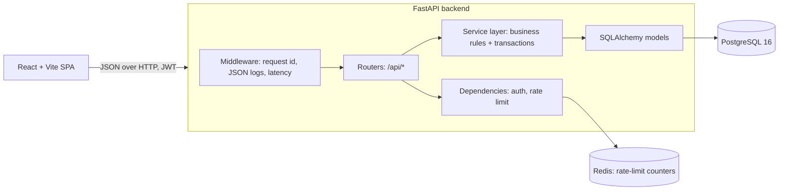

# ShopFlow — Design

> Status: **Phase 1 plan.** Sections marked *(later)* are filled in by the phase that builds them.

## 1. Problem

A small store sells limited stock. When many people check out at the same moment (a flash sale),
the system must never sell more units than exist, must not create duplicate orders when a client
retries, and must stay responsive when one user hammers the checkout button.

## 2. Architecture

**Layers and who owns what**

| Layer | Owns | Must not |
|---|---|---|
| `api/` routers | HTTP: parse request, call a service, shape response | contain business rules or SQL |
| `schemas/` (Pydantic) | request/response validation, OpenAPI docs | touch the DB |
| `services/` | business rules, transaction boundaries, locking | know about HTTP status codes directly (they raise domain errors) |
| `models/` (SQLAlchemy) | tables, constraints | contain logic |
| `core/` | config, security (JWT, hashing), errors, logging, Redis | — |

Domain errors (`NotFound`, `Conflict`, `InsufficientStock`, …) are raised in services and turned into
the single error envelope `{"error": {"code", "message", "details"}}` by one exception handler.

### Key decisions

| Decision | Choice | Why |
|---|---|---|
| Sync vs async DB | **Sync** SQLAlchemy 2.x + psycopg 3, sync route functions (FastAPI runs them in a threadpool) | Easier to read and explain; row locks behave identically. Throughput limit = threadpool + pool size, which we will measure, not guess. |
| Money | `BIGINT` **paise** with `CHECK (price_paise > 0)` | No float rounding. API exposes `price_paise` (int); the UI formats ₹. |
| Stock location | Separate `inventory` table, 1:1 with `products` | Checkout locks only inventory rows; editing a product's name/description never contends with checkout locks. |
| Negative stock | App check **and** `CHECK (quantity >= 0)` | App check gives a nice 409; the constraint is the last line of defence if code is ever wrong. |
| Cart | `carts.user_id UNIQUE` → one cart per user, emptied on checkout | "One active cart" without a status column or partial index. |
| Password hashing | argon2id via `argon2-cffi` | OWASP's first recommendation; library handles salts and params. |
| JWT | PyJWT, HS256, short-lived access token, claim `sub=user_id` only | Role is read from the DB on each request, so a role change takes effect immediately. |
| Admin creation | Only via seed script; `/register` always creates `customer` | No privilege escalation through a public endpoint. |
| Logging | stdlib `logging` + a ~20-line JSON formatter | No extra dependency; easy to explain. |

## 3. Data model

Indexes beyond PKs/uniques: `orders(user_id, created_at)` ("my orders, newest first") and
`inventory_movements(product_id, created_at)` (stock history). PostgreSQL does **not** index foreign keys
automatically, so each FK was checked: `order_items.order_id` and `cart_items.cart_id` are covered by the
first column of a unique/primary key; the rest aren't queried by FK alone. Name search uses `ILIKE '%term%'`,
which a B-tree index can't help with anyway; a `pg_trgm` index is a *future improvement*.

### Schema decisions (built in phase 3)

- **Enums as `VARCHAR(20)` + a named `CHECK`**, not native PostgreSQL `ENUM` types. Adding a value to a
  native enum needs `ALTER TYPE`; a CHECK constraint is simply dropped and re-created in a migration.
- **Constraint naming convention** on `Base.metadata` (`ck_<table>_<name>`, `uq_<table>_<cols>`, …). Names
  are deterministic, so migrations can drop them, and an `IntegrityError` names the exact rule that failed
  (the constraint tests assert on those names).
- **`created_at`/`updated_at` default to `now()` in the DB**, so rows inserted by raw SQL get them too. Note that
  `now()` is the *transaction* start time: every row written in one checkout shares one timestamp.
- **Identity columns** (`GENERATED BY DEFAULT AS IDENTITY`), the SQL-standard replacement for `SERIAL`.
- **Emails are stored lower-case**, guarded by `CHECK (email = lower(email))`, so the unique index is
  effectively case-insensitive without needing `citext`.
- The migration was drafted with `--autogenerate` and then **rewritten by hand**. Review found the draft
  emitted each enum CHECK twice. A test (`alembic check`) fails if models and migrations ever drift apart.

## 4. Checkout — the core flow (sketch; full write-up in phase 8/9)

One transaction, in this order:

1. **Idempotency:** `INSERT INTO idempotency_keys ... ON CONFLICT (user_id, key) DO NOTHING RETURNING id`.
   If a concurrent request with the same key hasn't committed yet, PostgreSQL makes this INSERT
   **wait** for it (unique-index check), so the second request never races the first. If nothing is
   returned, the key exists: same body hash → replay stored response; different hash → 409.
2. Load the cart items.
3. `SELECT ... FROM inventory WHERE product_id IN (...) ORDER BY product_id FOR UPDATE` —
   **sorted** so two carts `{A,B}` and `{B,A}` always lock A first → no deadlock cycle.
4. Check every line; collect *all* failures → 409 `INSUFFICIENT_STOCK` with the failing product ids.
5. Decrement stock, write `inventory_movements(reason=order)`.
6. Create `orders` + `order_items` (copy current price), clear cart.
7. Store the 201 response in the idempotency row, commit.

Failures roll back everything, **including the idempotency row**, so a client may retry the same key
after, e.g., a restock. Only successful responses are replayed. *(Trade-off documented in phase 9.)*

**Cancel:** lock the order row `FOR UPDATE` (so a double-cancel can't restore stock twice) → check
transition → lock inventory rows sorted by product id → add stock back + `cancel` movements.

**Status transitions** (anything else → 409):
`pending → confirmed → shipped`, and `pending|confirmed → cancelled`. `shipped`/`cancelled` are terminal.

## 5. Rate limiting (sketch)

Fixed window per user: `INCR rl:checkout:{user_id}:{window_start}` + `EXPIRE` in one pipeline.
Over the limit → 429 with `Retry-After` = seconds to window end. `RedisError` → allow the request and
log a warning (**fail open**: a Redis outage shouldn't stop all sales; the DB still prevents overselling).

## 5b. Observability (built in phase 2)

- Every log line is one JSON object with `timestamp, level, logger, message, request_id` plus any
  `extra=` fields. The request middleware logs `method, path, status, latency_ms` per request.
- `X-Request-ID`: reused if the caller sends a safe value (`[A-Za-z0-9._-]{1,64}`), otherwise a uuid4;
  echoed in the response header.
- Unhandled exceptions: traceback logged server-side, client gets a generic 500 in the error envelope.
- `GET /api/health`: DB down → **503** `unavailable`; Redis down → **200** `degraded` (rate limiting fails
  open, so the API still works); both up → 200 `ok`.
- Timeouts are short so a dead dependency fails fast: DB connect 3 s, Redis 0.5 s. With Redis down,
  `/api/health` took ~0.5 s (local measurement on the dev machine, Windows, 3 requests).

## 6. Testing strategy (sketch)

- pytest against a real PostgreSQL test database (`<db>_test`, created automatically on the same server),
  schema created by running the Alembic migrations (so migrations are tested too); tables truncated
  (`TRUNCATE ... RESTART IDENTITY CASCADE`) after every test.
- Migration tests: full downgrade → upgrade round trip, plus `alembic check` for model/migration drift.
- Constraint tests break each rule and assert PostgreSQL rejects it **by constraint name**.
- Tests that need Redis are skipped with a visible reason when Redis isn't reachable (local dev without
  Docker); wherever Redis runs, they run.
- Real Redis on a separate logical DB index, flushed between tests.
- Concurrency tests start a real uvicorn server in a background thread and fire requests from a
  thread pool — so the locking is exercised through the full HTTP stack, not a mocked session.

## 7. Load test *(later — phase 14)*

## 8. Proposed deviations from the spec (need approval)

1. **Add `PATCH /api/orders/{id}/status` (admin only)** to move `pending → confirmed → shipped`.
   The spec's endpoint list only has `cancel`, so without this the non-cancel transitions can't happen.
2. **Checkout body = `{"shipping_address": "..."}`.** The order comes from the cart, so without a body
   "same key, different body → 409" would be untestable. A shipping address is a natural field.
3. **Only successful checkouts are stored for replay** (see §4).
